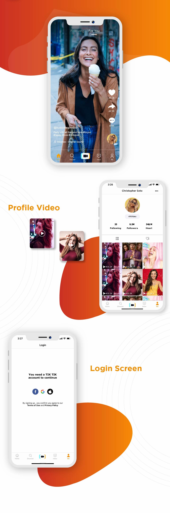
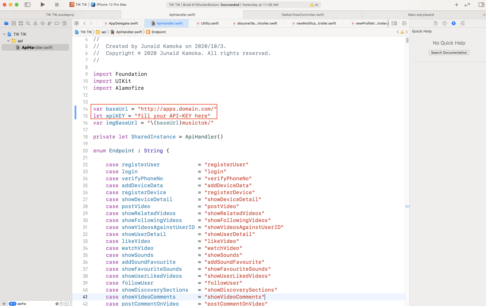

# TicTok Clone
> IOS media app for creating and sharing short videos

## Description

 IOS app for creating and sharing short videos. The customizable social video application to build your own trending video sharing platform with video dubbing features, various filters & social media integrations & more.

## Install

- AppStore (recommend)

  > [**VideoSmash** https://codecanyon.net/item/tictic-ios-media-app-for-creating-and-sharing-short-videos/23915600](https://codecanyon.net/item/tictic-ios-media-app-for-creating-and-sharing-short-videos/23915600)

## Basic App Setup

- How to Setup API URL
  Just go there AppDelegate file and Change BaseURL of your API and set API-KEY
  
  ** Before run this project, you need to set Web API first then app will be works fine.
  Please contact with me for Web API.

- xCode installation process
  Drag and drop Project folder in Terminal with the start.
  Just type "pod install" to install all pods.

## Contact Information
hulala07@outlook.com
